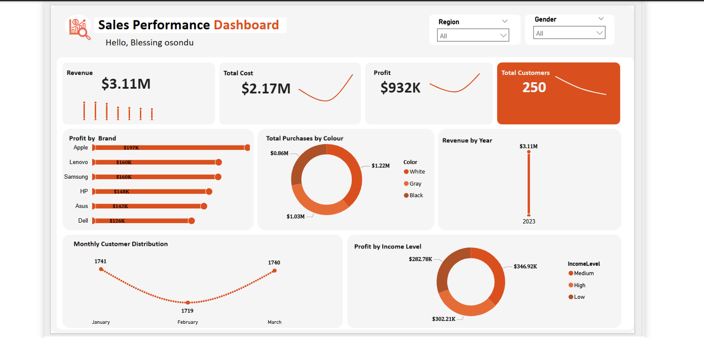

 # Sales Performance Dashboard (Power BI Project)

## Project Overview
This project is a Sales Performance Dashboard developed using Power BI as part of my learning journey at TS Academy. The objective of this project was to transform raw transactional sales data into meaningful business insights that support decision-making.
The dataset used contains approximately 5,200 sales transaction records across three tables:
- Sales Table
- Customer Table
- Product Table
The dashboard focuses on analyzing revenue performance, profitability drivers, customer behaviour, and product trends across key business segments.
---

## Dashboard Preview

##  Tools Used
- Power BI Desktop
- Power Query (Data Cleaning & Transformation)
- Data Modeling
- DAX (Basic Measures)
- Interactive Data Visualization
---

## Key Performance Indicators (KPIs)
The dashboard highlights four key business performance indicators:
- Total Revenue: $3.11M
- Total Cost: $2.17M
- Total Profit: $932K
- Total Customers: 250
These KPIs provide a quick snapshot of overall business performance within the reporting period.
---

## Business Questions Answered
The dashboard was designed to answer the following business questions:
1. Which brand generates the highest profit?
2. Which product colour has the highest purchase value?
3. What is the revenue performance within the reporting year?
4. How are customers distributed monthly?
5. Which income level contributes the most profit?
---

## Key Insights

### Profit by Brand

Apple emerged as the most profitable brand, generating the highest contribution to total profit. This indicates strong customer demand and consistent market preference for Apple products compared to competing brands such as Lenovo, Samsung, HP, Asus, and Dell.
This insight suggests an opportunity to prioritize Apple inventory availability and promotional strategies to further improve profitability.
---

### Total Purchase by Colour
White-coloured products recorded the highest purchase value at $1.22M, outperforming gray and black product variants. This reflects a strong customer preference for neutral product aesthetics.
Aligning inventory decisions with this demand pattern can help improve future sales performance.
---

### Revenue Performance

The dashboard shows total revenue of $3.11M generated within the reporting period (2023). This represents overall business sales performance across all regions, customer segments, and product categories included in the dataset.
---

### Monthly Customer Distribution

Customer transaction activity declined slightly from 1,741 transactions in January to 1,719 in February before recovering to 1,740 in March.
This pattern suggests a temporary dip in customer activity rather than a sustained decline, indicating generally stable engagement across the reporting quarter.
---

### Profit by Income Level

Medium-income customers contributed the highest share of total profit at approximately $346K, making them the most valuable customer segment within the dataset.
This insight highlights an opportunity for targeted marketing strategies focused on medium-income customers to improve long-term profitability.
---

## Summary Insight
Overall analysis shows that brand performance, product colour preference, and customer income level are key drivers of profitability and sales performance within this dataset.
---

##  Learning Outcome
Through this project, I strengthened my practical skills in:
- Data cleaning and transformation
- Building relationships between multiple tables
- Creating interactive dashboards
- Applying slicers for dynamic filtering
- Translating raw data into business insights using Power BI
---

##  Acknowledgement

Special thanks to my tutor, Mr. Ezekiel Aleke, for the guidance, patience, and structured teaching approach throughout this project.
---

## Contact

LinkedIn: https://www.linkedin.com/in/blessing-osondu-ba4687300
